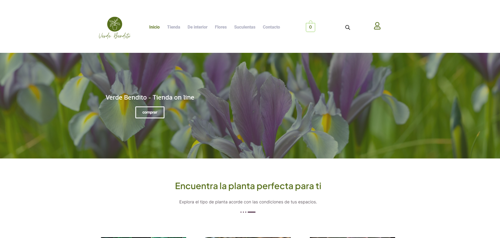

# Tienda on line - Venta de Plantas de Verde Bendito

## Índice
* [1. Descripción](#1-descripción)
* [2. Sobre Desarrollo del Producto](#2-sobredesarrollodelproducto)
* [3. Estado de Desarrollo del Producto](#3-estadodedesarrollodelproducto)

## 1. Descripción

Este proyecto consiste en una tienda en línea de una empresa hipotética dedicada a la venta de plantas, que busca expandir su mercado a través de ventas en línea. La tienda incluye diversas secciones, como una página de inicio que sirve como presentación, una página principal de la tienda que muestra la variedad de productos, la clasificación de productos por categorías, un carrito de compras y una página de cuenta para los posibles compradores. Además, se ha incluido una página de contacto para facilitar la comunicación.  
La tienda en línea ha sido diseñada para ser completamente responsiva, lo que significa que es accesible y funcional en dispositivos de diferentes tamaños, como PC, tabletas y teléfonos móviles. Se ha prestado especial atención al diseño responsive para asegurar una experiencia óptima en smartphones, aquí unas imágenes:  

## 2. Sobre Desarrollo del Producto

Para desarroolar mi proyecto en WordPress usando Elementor y WooCommerce, preparé un entorno de desarrollo local utilizando XAMPP como mi servidor localhost. Aquí algunos detalles:  

**Instalé XAMPP:** Descargué e instalé XAMPP, una solución de desarrollo local que incluye Apache, MySQL, PHP y phpMyAdmin. Esto me proporcionó un entorno de servidor web y base de datos local en mi computadora.

**Configuré Virtual Hosts:** Configuré virtual hosts en XAMPP para que mi proyecto de WordPress tuviera su propio dominio local, lo que facilitó la administración y la prueba del sitio web.

**Instalé WordPress:** Descargué e instalé WordPress en mi localhost. Esto implicó crear una base de datos en phpMyAdmin, configurar la conexión de WordPress a la base de datos y realizar la instalación básica de WordPress.

**Añadí Elementor y WooCommerce:** Instalé los complementos Elementor y WooCommerce desde el panel de administración de WordPress para habilitar la creación de páginas y la funcionalidad de comercio electrónico en mi proyecto.

Una vez que mi entorno de desarrollo estuvo configurado, pude comenzar a trabajar en mi proyecto de WordPress con Elementor y WooCommerce. Utilicé XAMPP para iniciar mi servidor local y acceder al panel de administración de WordPress en mi navegador. Desde allí, pude personalizar y diseñar mi sitio web utilizando Elementor y configurar la tienda en línea con WooCommerce.

A lo largo del desarrollo, usé git y github como sistema de control de versiones, que asegurara el resguardo de mis avances.

## 3. Estado de Desarrollo del Producto

El desarrollo de la tienda en línea incluye las funcionalidades básicas necesarias para una experiencia de compra sencilla que representó un importante ejercicio de aprendizaje. Sin embargo, es importante señalar que en un caso real para llevar el proyecto al siguiente nivel y lograr su pleno funcionamiento, se requeriría la implementación de los siguientes elementos:

**Hosting en Vivo:**  Actualmente, el proyecto se encuentra en un entorno de desarrollo local, lo que significa que no se pueden configurar enlaces reales ni acceder a él en línea. Para completar la tienda en línea, se necesita un hosting en vivo que permita a los usuarios acceder al sitio desde cualquier lugar del mundo. Esto permitirá configurar enlaces y rutas de navegación reales.

**Configuración de Pagos:** Para habilitar transacciones de compra y venta, es esencial configurar pasarelas de pago seguras y confiables. Esto incluye la integración con servicios de pago como PayPal, Stripe o cualquier otro método de pago preferido por los usuarios.

**Opciones de Cuenta y Registro:** Los compradores deben tener la capacidad de crear cuentas, iniciar sesión y realizar un seguimiento de sus pedidos. La configuración de un sistema de registro y autenticación es crucial para brindar una experiencia personalizada a los usuarios y fomentar la fidelidad del cliente.  

**Personalización de Productos:** Agregar la capacidad de personalizar más las plantas, como características de lugar ideal para su salud, deatalles de cuencos y otras opciones,  puede mejorar la experiencia del comprador y aumentar la versatilidad de tu tienda en línea.

**Seguridad:** La seguridad es fundamental para proteger tanto los datos de los usuarios como la integridad de la tienda en línea. La implementación de medidas de seguridad, como certificados SSL y prácticas de seguridad recomendadas, es esencial para mantener la confianza de los clientes.

**Optimización de SEO:** Para atraer tráfico orgánico a la tienda en línea, es importante realizar una optimización de motores de búsqueda (SEO). Esto implica configurar metaetiquetas, palabras clave y asegurarse de que el contenido sea fácilmente indexable por los motores de búsqueda.

